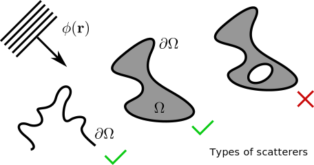
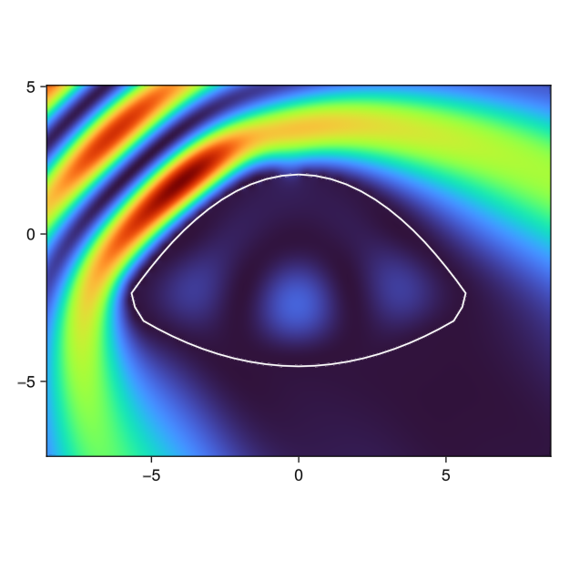

# BoundaryWall.jl

*Scattering Toolbox written in Julia.*

Please read the tutorials while I finish the documentation.

## Overview

**BoundaryWall.jl** provides a collection of algorithms and tools for 
calculating the scattering of arbitrary boundaries, based upon the work of
[M. G. E. da Luz, A. S. Lupu-Sax, and E. J. Heller on Quantum Scattering](https://doi.org/10.1103/PhysRevE.56.2496), 
written in pure Julia.

The design of this project was motivated for calculating eigenstates 
and scattering wavefunctions in billiards ([F.M. Zanetti et al.](https://doi.org/10.1016/j.aop.2008.01.008), 
[A. Ruiz-Biestro et al.](https://doi.org/10.1103/PhysRevE.109.034203)).

This raises an important detail about possible applications. This is a **Boundary Integral Method**,
which limits the applicable domains to 2D curves consisting of: [simply 
connected curves](https://mathworld.wolfram.com/SimplyConnected.html), open curves, or a collection of the previous two. 
Boundaries with intersections and inner loops **will generally not work**.
While the method does not require a parametrization of the boundary, it
does require certain homogeneity in arc length. For more details about
the implementation and theoretical foundations, see the [Geometry](geometry.md)
section.



If you have questions or would like to brainstorm ideas, don't hesitate 
to contact me. I'd be happy to talk about the project and improve the
toolbox in general.


## Installation

Since this is not a package yet, one must clone this github repository or download the zip archive and extract all files. 

1. Enter the parent directory `BoundaryWall.jl`.
2. Enter the following command to open the Julia REPL.

```sh
$ julia --project=.
```

Once in the REPL, do the following to precompile the dependencies.

```julia-repl
julia> using Pkg
julia> Pkg.instantiate()
```

3. Done! 

## Quick guide

```julia
using BoundaryWall
using CairoMakie

begin # definitions
HBAR        = 1.0
MASS        = HBAR/2
SIGMA       = (2*MASS/HBAR^2)*(1/4*im)
N           = 100
NDOM        = 150
ϕ           = 135
waveVector  = sqrt(1.365)*SVector(cosd(ϕ), sind(ϕ)) # parabolic billiard eigenstate
end
```

Obtain the relevant information for algorithm.

```julia
y, x,ym, xm, distance_matrix, arc_lengths = createConfocalBilliard(2.0, 3.0, N)
```

Construct a domain.

```julia
using Meshes
x0, xf = (-8.5, 8.5)
y0, yf = (-7.5, 5)
xdom = LinRange(x0, xf, NDOM)
ydom = LinRange(y0, yf, NDOM)
GRID = RectilinearGrid(xdom, ydom)
MESH = SimpleMesh(vertices(GRID), GRID.topology)
COORDS = SVector.(coordinates.(vertices(MESH)))

XDOM, YDOM = first.(COORDS), last.(COORDS)
```

Simulate of plane wave impinging on the chosen parabolic billiard, considering an impermeable barrier. Calculate at points $(x,y)$.
```julia
banded = 2
@time wave = boundaryWallWave(waveVector, (k,r)->planeWave(k,r), x, y, xm, ym, XDOM, YDOM, SIGMA, arc_lengths, distance_matrix, length(arc_lengths), N, banded, Inf);
```

Plot the resulting field.
```julia
using GLMakie # or Cairo backend

f,ax=heatmap(xdom, ydom, abs2.(reshape(wave, NDOM, NDOM)), colormap=:turbo)
lines!(ax, x,y,color=:white)
ax.aspect=DataAspect()
f
```

